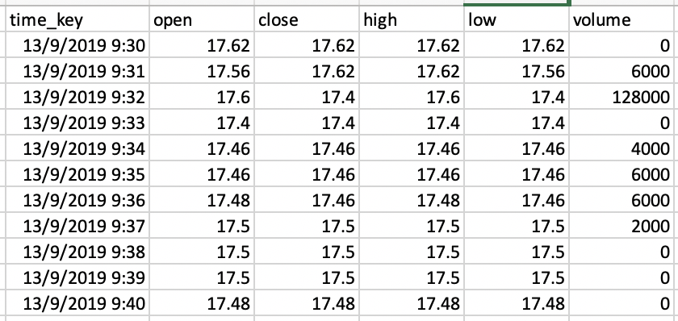

# QTrader: A Light Event-Driven Algorithmic Trading Engine

QTrader is a light and flexible event-driven algorithmic trading engine that can be used to backtest strategies, 
and seamlessly switch to live trading without any pain.

## Key features

* Completely **same code** for backtesting/simulation/live trading 

* Currently only support equity trading

## Quick install

You may run the folllowing command to install QTrader immediately:

```python
# python 3.7 or above is supported
>> conda create -n qtrader python=3.7
>> conda activate qtrader
>> pip install git+https://github.com/josephchenhk/qtrader@master
```

## Get the data ready

QTrader supports 1 minute bar data at the moment. What you need to prepare is CSV files with file names in the format of 
"[symbol]-yyyy-mm-dd.csv"



And you should specify the path of data folder in `qtrader.config.config.py`. For example, set

```python
DATA_PATH = "./qtrader/examples/data" 
```

and put all your CSV files to the following folder:

```python
{DATA_PATH}/k_line/K_1M
```

## How to implement a strategy

To implement a strategy is simple in QTrader. A strategy needs to implement `init_strategy` and `on_bar` methods in 
`BaseStrategy`. Here is a quick sample:

```python
from qtrader.core.strategy import BaseStrategy

class MyStrategy(BaseStrategy):

    def init_strategy(self):
        pass
        
    def on_bar(self, cur_data:Dict[Stock, Bar]):
        print(cur_data)
```

        
## How to record anything I want

QTrader provides a module named `BacktestRecorder` to record variables during backtesting. By default, it saves `datetime` 
and `portfolio_value` every timestep. 

If you want to record additional variables (let's say it is called `var`), you need to write a method called `get_var` in your strategy:

```python
from qtrader.core.strategy import BaseStrategy

class MyStrategy(BaseStrategy):

    def get_var(self):
        return XXX
```

And initialize your `BacktestRecorder` with the same vairable `var=[]`（if you want to record every timestep） or `var=None`
（if you want to record only the last updated value）:

```python
recorder = BacktestRecorder(var=[])
```
    
## Run a backtest

Now we are ready to run a backtest. Here is a sample of running a backtest in QTrader:

```python
# prepare stocks
stock = Stock(code="HK.01157", lot_size=200, stock_name="中联重科")
stock_list = [stock]

market = BacktestGateway(
    securities=stock_list,
    start=datetime(2021, 3, 15, 9, 30, 0, 0),
    end=datetime(2021, 3, 17, 16, 0, 0, 0),
)

# position management
position = Position()
# account balance management
account_balance = AccountBalance()
# portfolio management
portfolio = Portfolio(account_balance=account_balance,
                      position=position,
                      market=market)
# execution engine
engine = Engine(portfolio)

# initialize strategy
strategy = DemoStrategy(securities=stock_list, engine=engine)
strategy.init_strategy()

# start event engine
recorder = BarEventEngineRecorder()
event_engine = BarEventEngine(strategy, recorder, trade_mode=TradeMode.BACKTEST)
event_engine.run()

# save recorder
recorder.save_csv()
if "analysis" in plugins:
    # plot profit and loss curve
    plot_pnl = plugins["analysis"].plot_pnl
    plot_pnl(recorder.datetime, recorder.portfolio_value)
```


## Live trading

Ok, your strategy looks good now. How can you put it to live trading? In QTrader it is
extremely easy to switch from backtest mode to simulation or live trading mode. What you 
need to modify is just **two** lines:

```python
...

# specify the live trading gateway
market = FutuGateway(
    securities=stock_list,
    end=datetime(2021, 3, 18, 16, 0, 0, 0),
)

...

# turn on Simulation/Livetrading mode
event_engine = BarEventEngine(strategy, recorder, trade_mode=TradeMode.SIMULATE)
event_engine = BarEventEngine(strategy, recorder, trade_mode=TradeMode.LIVETRADE)

...
```


Here you go! Enjoy the trading.

**Important Notice**: In the demo sample, the live trading mode will keep sending orders, please be aware 
of the risk when running it.

